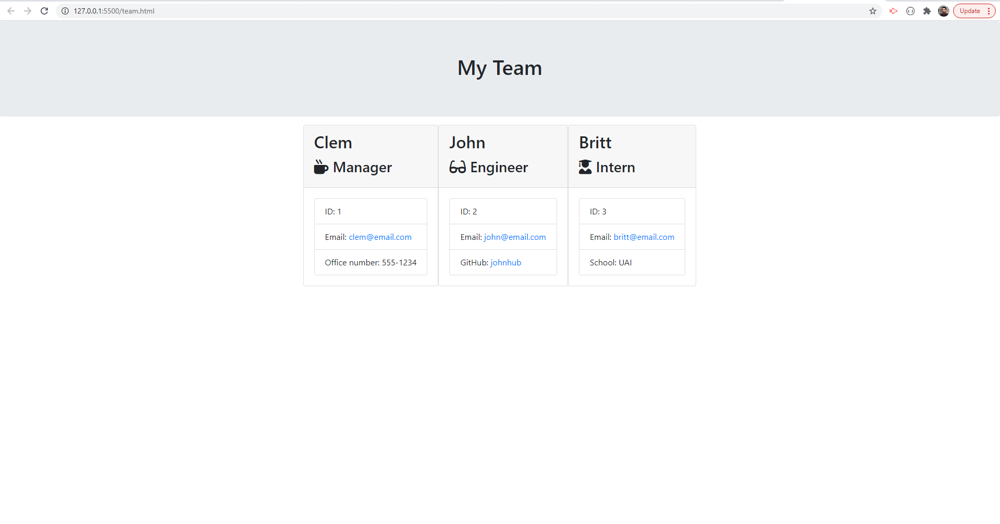

# homework-10

Team Profile Generator


## Links:

GitHub repository: 
https://github.com/Clem-ent17/Team-Profile-Generator

Live link to access the application:
None


## Demonstration links:

https://drive.google.com/file/d/1qZI-Q68PGGXWJswz4GwBjpxA_vvmZgjv/view


## User story:

* As a manager

* I want to generate a webpage that displays my team's basic info

* so that I have quick access to emails and GitHub profiles


## Description:

This project prompt the user to build an engineering team. An engineering team consists of a manager, and any number of engineers and interns.



I built a software engineering team generator command line application. The application will prompt the user for information about the team manager and then information about the team members. The user can input any number of team members, and they may be a mix of engineers and interns. This application also pass all unit tests. When the user has completed building the team, the application will create an HTML file that displays a nicely formatted team roster based on the information provided by the user. 


## Installation:

* In the `Develop` folder, there is a `package.json`, make sure to `npm install` and install the package.

* The dependencies are, [jest](https://jestjs.io/) for running the provided tests, and [inquirer](https://www.npmjs.com/package/inquirer) for collecting input from the user.


## Test:

You can run the tests at any time with `jest`

The jest test files are the following:

```
test/
  Employee.test.js
  Engineer.test.js
  Intern.test.js
  Manager.test.js
```


## Usage:

* This app run as a Node CLI to gather information about each employee.

* The user will start the App in its terminal with the command `node app.js`

* A series of questions will be asked to fill the employee caracteristics:
  * Name

  * Role (Manager, Engineer, Intern)

  * ID

  * Role-specific property (School, link to GitHub profile, or office number)

* At the end of this employee questions, the app will request if the use wants to continue adding employee, or not (yes/no question)

* If yes, the user will be able to add new employees

* If no, the App will generate a `team.html` page in the `output` directory, that displays a nicely formatted team roster. 


## Technologies:

* Technology used in this application: 
    - HTML
    - CSS
    - Bootstrap
    - JavaScript
    - GitHub

* npm dependencies: 
    - [jest](https://jestjs.io/)
    - [inquirer](https://www.npmjs.com/package/inquirer)


## Project status:

* Work as completed.

* Possible improvement: 
    - Use validation to ensure that the information provided is in the proper expected format.

- - -

Clement Valles